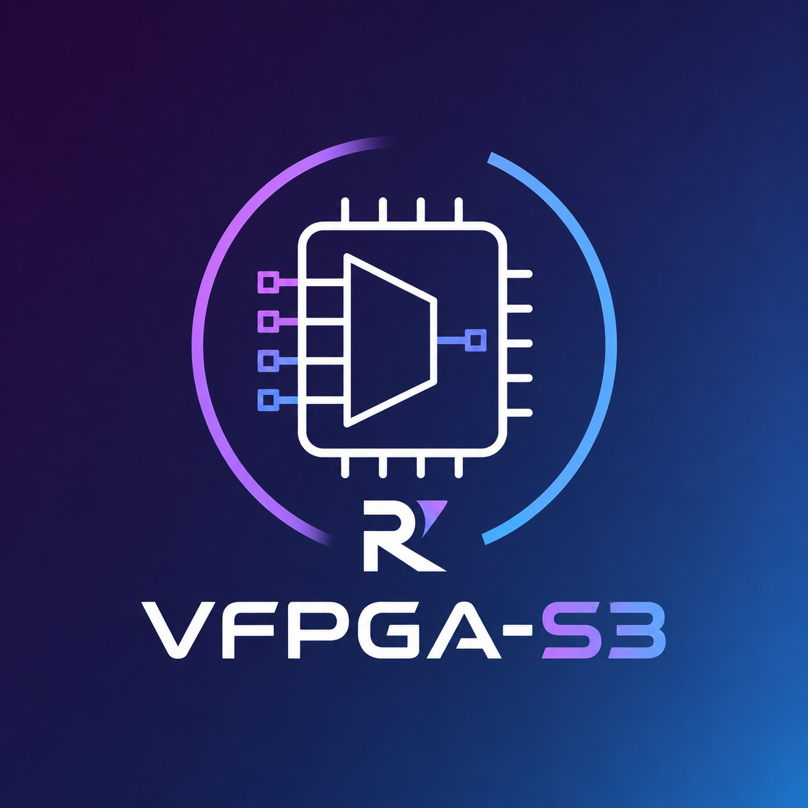
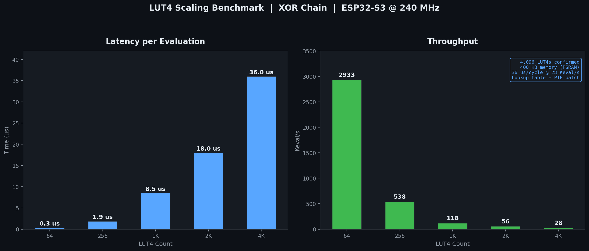
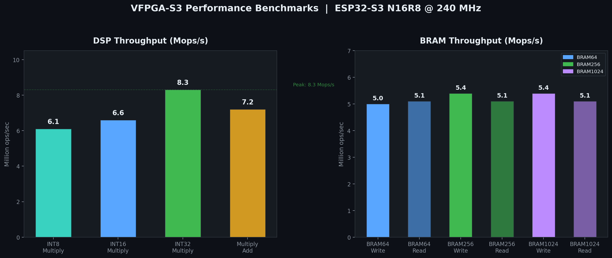
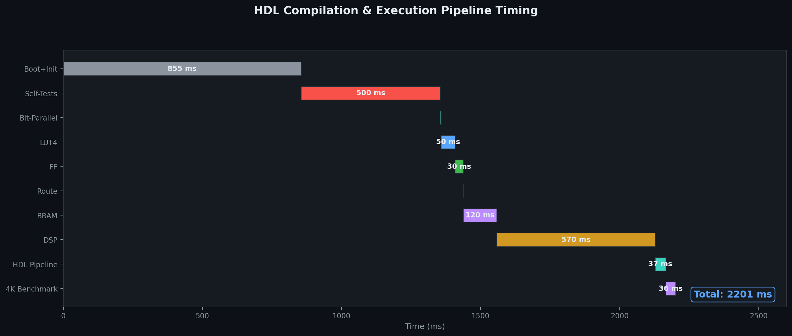
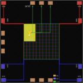
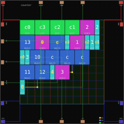
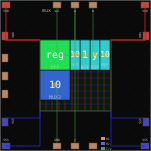
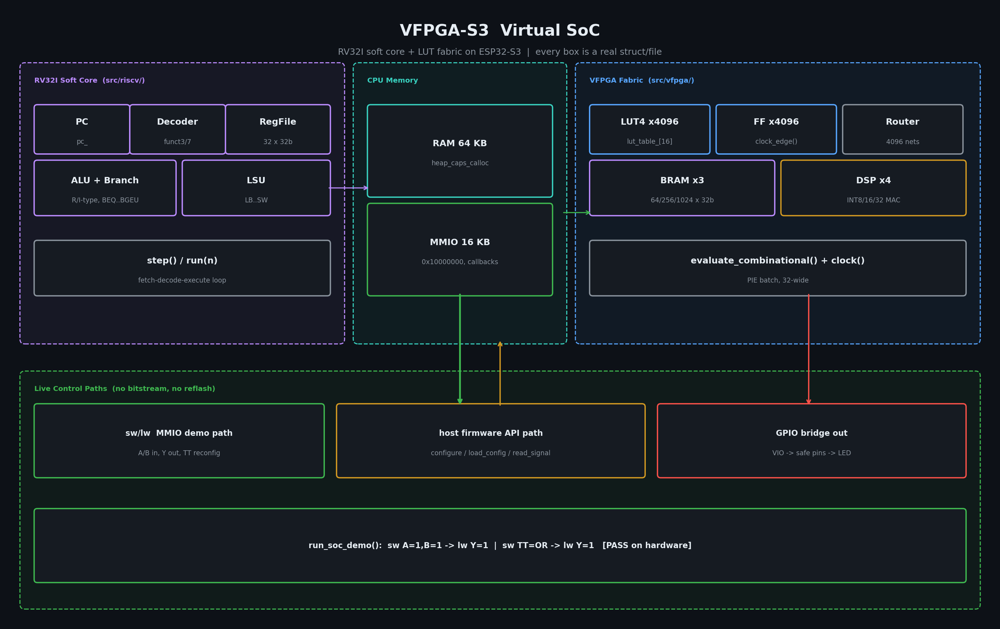
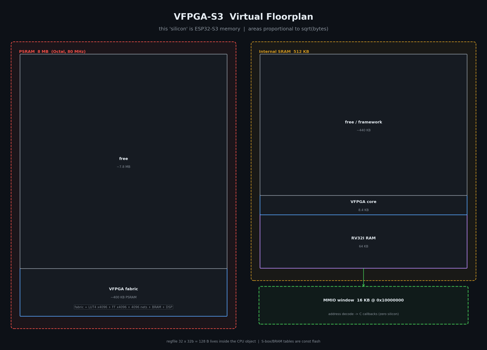
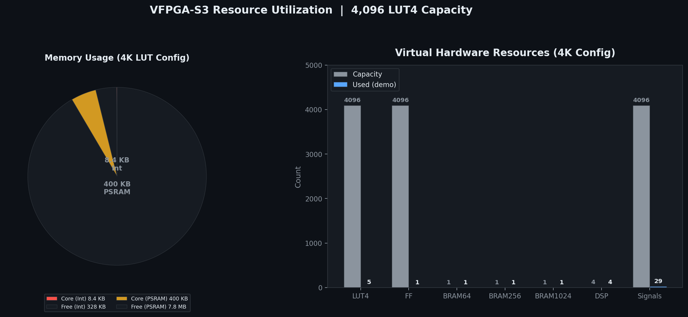

<div align="center">
<h1>VFPGA-S3</h1>



<h4>Software-defined virtual FPGA on ESP32-S3 N16R8. UP5K-class LUT capacity (4,096 LUT4s) entirely in software, with a full HDL toolchain and an integrated RV32I RISC-V CPU. Reconfigurability with zero hardware barrier to entry: software-defined logic on a low-cost microcontroller.</h4>

<p><b>51/51 automated tests PASS on hardware</b> · 4,096 LUT4s · RV32I CPU · HDL toolchain · Host FPGA simulator · CI: firmware build + HDL/sim host tests</p>

<p>
  
  
  
  
</p>
</div>

---

## Hardware

| Component | Value |
|-----------|-------|
| Board | ESP32-S3-DevKitC-1 N16R8 |
| SoC | ESP32-S3 rev 2, Xtensa LX7, 2 cores @ 240 MHz |
| PSRAM | 8 MB (Octal, 80 MHz) |
| Flash | 16 MB (QIO) |
| Framework | ESP-IDF 6.0.1 (PlatformIO) |

## VFPGA Capacity

| Resource | Count | Memory |
|----------|-------|--------|
| LUT4s | 4,096 | 48 KB |
| Flip-Flops | 4,096 | 48 KB |
| Signals | 4,096 | 16 KB |
| BRAM | 3 configurable software BRAM blocks (64/256/1024 x 32-bit) | 96 bytes |
| DSP | 4 configurable software multiply-accumulate units (INT8/16/32) | — |
| **Total** | | **~400 KB PSRAM** |

**UP5K-class software-defined FPGA fabric** (4,096 LUT4s, approaching the LUT capacity of the Lattice iCE40 UP5K's 5,280 LUTs; timing, routing, DSP, and memory architectures differ fundamentally from silicon).

---

## Performance

| LUT4 Count | Latency | Throughput |
|------------|---------|------------|
| 64 | 0.3 us | 2,933 Keval/s |
| 256 | 1.9 us | 538 Keval/s |
| 1,024 | 8.5 us | 118 Keval/s |
| 4,096 | 36.0 us | 28 Keval/s |

| Resource | Peak |
|----------|------|
| DSP (INT32 multiply) | 8.3 Mops/s |
| BRAM (read/write) | ~5.0 Mops/s |




---

## Architecture


```
HDL -> Parser/Netlist -> Mapper -> VFPGA Fabric (LUT4/FF/BRAM/DSP) -> Bit-Parallel Execution -> ESP32-S3 (240 MHz)
```

```
src/
  engine/          Bit-parallel evaluation engine
  vfpga/           LUT4, FlipFlop, BRAM, DSP, routing, core
  hdl/             Lexer, parser, netlist, mapper (HDL toolchain)
  hdl/user_design.h  User-editable HDL design (edit this, re-flash)
  riscv/           RV32I CPU (37 instructions, 64KB RAM, MMIO), Virtual SoC demo
  io/              GPIO, board detection
  benchmarks/      Logic/DSP/BRAM benchmarks, engine profiler, fabric golden-vector suite
  tests/           All test suites (51 tests)
  main.cpp         Entry point, user HDL workflow
  demo_run.cpp     Built-in demos, tests, and legacy code
  isa_test_vectors.h  Generated RV32I coverage vectors (via host_test/gen_isa_test.py)
```



---

## Quick Start

### Build & Flash

```bash
pio run -t upload
```

### Serial Monitor

```bash
pio device monitor -b 115200
```

### Expected Output

```
VFPGA-S3
  Board: ESP32-S3-DevKitC-1 N16R8
  === User HDL Design ===
  LUTs: 1, FFs: 0
  Inputs: a, b
  Outputs: y
  [00] y = 0
  [10] y = 0
  [01] y = 0
  [11] y = 1
  VFPGA-S3 Final Report
  Done. System idle.
```

---

## Using the VFPGA Core

```cpp
#include "vfpga/vfpga_core.h"

VfpgaCore core;
core.init(64, 0);  // 64 LUTs, 0 FFs

// Configure LUT 0 as AND gate (truth table 0x8000)
core.get_lut(0).configure(0x8000);

// Wire inputs
core.get_lut(0).set_input(0, 1);  // a = 1
core.get_lut(0).set_input(1, 1);  // b = 1

// Evaluate
core.evaluate_combinational();
bool result = core.get_lut(0).get_output();  // true
```

## Running Your Own HDL Design

Edit `src/hdl/user_design.h`, replace the `USER_HDL` string with your design, re-flash:

```cpp
// src/hdl/user_design.h
static const char *USER_HDL =
    "module my_counter;\n"
    "input clock;\n"
    "input reset;\n"
    "output [3:0] count;\n"
    "register [3:0] cnt;\n"
    "always @(posedge clock) begin\n"
    "    if (reset) cnt <= 0;\n"
    "    else cnt <= cnt + 1;\n"
    "end\n"
    "assign count = cnt;\n"
    "endmodule\n";
```

The pipeline auto-detects combinational vs sequential, enumerates test vectors, and prints results. For sequential designs, it finds `clock`/`reset` inputs and runs `USER_CYCLES` iterations.

See [HDL_GUIDE.md](docs/HDL_GUIDE.md) for full syntax and examples.

The same designs can also be emitted as synthesizable Verilog (`src/hdl/verilog_emit.h`) and checked with Icarus Verilog simulation plus a Yosys synthesis smoke test in CI.

## No-Board Workflow (Host Simulation)

Learn the FPGA flow without hardware: compile, simulate with a testbench, and inspect waveforms in GTKWave. See [SIMULATOR.md](docs/SIMULATOR.md) for the full guide.

```bash
# build the host CLI (C++17)
g++ -std=c++17 -Wall -Isrc/hdl -Ihost_test/stubs \
  -Ihost_test/simulator -Ihost_test/waveform -Ihost_test/testbench \
  -Ihost_test/physical \
  tools/cli/main.cpp host_test/simulator/sim.cpp \
  host_test/testbench/tb.cpp host_test/testbench/tb_exec.cpp \
  host_test/testbench/auto_tb.cpp \
  host_test/waveform/vcd.cpp host_test/waveform/gtkwave.cpp \
  host_test/physical/physical_design.cpp \
  src/hdl/lexer.cpp src/hdl/parser.cpp \
  src/hdl/netlist.cpp src/hdl/mapper.cpp \
  -o build/vfpga

# verify a tutorial design and open the waveform
build/vfpga verify examples/tutorial/06_counter/design.v \
  --tb examples/tutorial/06_counter/design.tb --wave --open
```

## ASIC-Style Physical Design (Educational)

The same HDL also runs through an educational ASIC backend: standard-cell
mapping → floorplan → placement → routing → layout DB. Abstract units,
estimated timing, Educational DRC — a teaching model, not foundry-accurate.
See [PHYSICAL_DESIGN.md](docs/PHYSICAL_DESIGN.md).

```bash
build/vfpga build examples/physical/counter.v --svg
build/vfpga report examples/physical/mux.v
```

### Chip Layout Visualization

<table>
<tr>
<td align="center"><br><sub>AND gate (1 cell)</sub></td>
<td align="center"><br><sub>4-bit counter (25 cells)</sub></td>
<td align="center"><br><sub>MUX with register (6 cells)</sub></td>
</tr>
</table>

## RISC-V CPU

Integrated RV32I emulator with 37 instructions, 64 KB RAM, and memory-mapped I/O.

```cpp
#include "riscv/riscv_cpu.h"

RiscvCpu cpu;
cpu.reset();

uint32_t program[] = {
    0x00000513, // addi x10, x0, 0
    0x00100593, // addi x11, x0, 1
    0x00A00613, // addi x12, x0, 10
    0x00B50533, // add  x10, x10, x11
    0x00158593, // addi x11, x11, 1
    0xFEB65CE3, // bge  x12, x11, -8
    0x00000013, // nop
};

cpu.load_program(0, program, 7);
cpu.run(100);
uint32_t sum = cpu.get_reg(10);  // 55
```

See [RISC-V.md](docs/RISC-V.md) for full instruction set, examples, and encoding guide.



## Dynamic Reconfigurability & SoC Control

The entire fabric is software memory; there is no bitstream. The integrated RV32I soft core or the ESP32 host firmware can rewrite LUT truth tables, reload routing, and inspect internal signal states at runtime. No bitstream regeneration, no SPI reflash: just memory writes.

**From the RV32I soft core (via MMIO):** the [Virtual SoC demo](docs/RISC-V.md#virtual-soc-demo-cpu--fabric) maps fabric inputs, evaluated output, and the LUT truth table into the CPU's MMIO window at `0x10000000`. A RISC-V program reconfigures an AND gate to OR mid-execution with a single `sw`, demonstrated on hardware (`AND(1,1)=1`, then `OR(0,1)=1` after live reconfig `[PASS]`).

**From the ESP32 host firmware (via API):**

```cpp
core.load_config(new_cfg);          // rewrite LUT tables + routing live
core.write_input(id, value);        // drive fabric inputs
core.evaluate_combinational();
VSignal y = core.read_signal(id);   // inspect any internal net
```

LUT table rewrites and signal inspection are demonstrated on hardware; routing changes go through the same runtime `load_config()` path the toolchain itself uses — no reflash at any step.

**Contrast with cheap silicon:** on parts like the Lattice iCE40, partial reconfiguration or live fabric modification is effectively unavailable: changing a circuit means regenerating the bitstream off-chip and reflashing SPI flash. Here the "bitstream" is a C struct in RAM.



## Hardware Demo: HDL to GPIO LED

End-to-end pipeline: write HDL → compile/map → flash ESP32 → VFPGA routes to physical GPIO → LED blinks. `run_demo_gpio_led()` in `demo_run.cpp` compiles a 1-bit blinker through the full HDL toolchain, loads it into the fabric, and drives GPIO5:

```
Blink 1: led=1 -> GPIO5
Blink 2: led=0 -> GPIO5
...
```

Wire an LED (via resistor) to GPIO5 and ground to see it. Demo video/GIF placeholder.

---

## Resource Usage



| Component | Internal RAM | PSRAM |
|-----------|--------------|-------|
| VFPGA Core (4K) | 8.4 KB | 400 KB |
| Free | 328 KB | 7.8 MB |

---

## Capacity Context (not a speed comparison)

| FPGA | LUT4s | Clock | Notes |
|------|-------|-------|-------|
| **VFPGA-S3** | **4,096** | **28 Keval/s** | Software-defined, no hardware needed |
| Lattice iCE40 LP384 | 384 | 48 MHz | Physical FPGA |
| Lattice iCE40 UP5K | 5,280 | 48 MHz | Closest capacity reference |
| Gowin GW1NR-9 | 8,640 | 24 MHz | Physical FPGA |
| Xilinx Spartan-7 XC7S25 | 15,000 | 100 MHz | Physical FPGA |

The VFPGA-S3 does not compete with silicon FPGAs on clock speed. Its value proposition is reconfigurability, zero hardware barrier to entry, and software-defined logic on a low-cost microcontroller.

---

## Documentation

| File | Contents |
|------|----------|
| [INSTRUCTION.md](INSTRUCTION.md) | Full project specification and milestones |
| [AGENTS.md](AGENTS.md) | Environment setup for AI agents (compiler, GTKWave, per-platform) |
| [HDL_GUIDE.md](docs/HDL_GUIDE.md) | HDL syntax, examples, and pipeline usage |
| [SIMULATOR.md](docs/SIMULATOR.md) | Host simulator, testbench DSL, VCD/GTKWave workflow (no board needed) |
| [PHYSICAL_DESIGN.md](docs/PHYSICAL_DESIGN.md) | Educational ASIC backend: cells, floorplan, place, route, layout DB |
| [RISC-V.md](docs/RISC-V.md) | RV32I instruction set, API, programming examples |
| [performance.md](docs/performance.md) | Hardware benchmarks and comparison data |

---

## Acknowledgements

- **[Ponytail](https://github.com/dietrichgebert/ponytail)** : Code audit and review for ensuring the codebase stays minimal and efficient.

