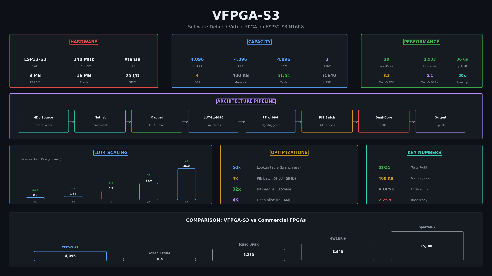
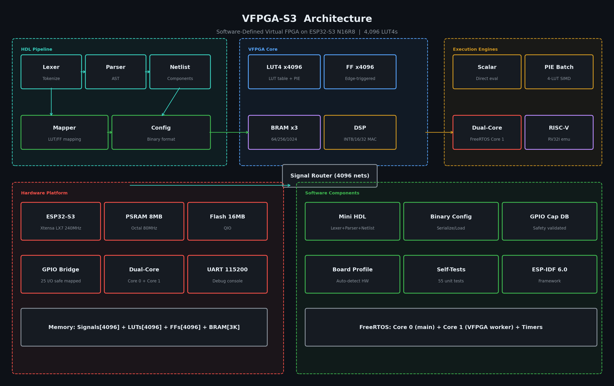

# VFPGA-S3

Software-defined virtual FPGA on ESP32-S3 N16R8. Runs LUT4-based designs entirely in software with a full HDL toolchain, 4K LUT capacity, and an integrated RV32I RISC-V CPU.



---

## Hardware

| Component | Value |
|-----------|-------|
| Board | ESP32-S3-DevKitC-1 N16R8 |
| SoC | ESP32-S3 rev 2, Xtensa LX7, 2 cores @ 240 MHz |
| PSRAM | 8 MB (Octal, 80 MHz) |
| Flash | 16 MB (QIO) |
| Framework | ESP-IDF 6.0.1 (PlatformIO) |

## VFPGA Capacity

| Resource | Count | Memory |
|----------|-------|--------|
| LUT4s | 4,096 | 48 KB |
| Flip-Flops | 4,096 | 48 KB |
| Signals | 4,096 | 16 KB |
| BRAM | 3 blocks (64/256/1024 x 32-bit) | 96 bytes |
| DSP | 4 (INT8/16/32 multiply-add) | — |
| **Total** | | **~400 KB PSRAM** |

Equivalent to a **Lattice iCE40 UP5K** (5,280 LUTs) in capacity.

---

## Performance

| LUT4 Count | Latency | Throughput |
|------------|---------|------------|
| 64 | 0.3 us | 2,933 Keval/s |
| 256 | 1.9 us | 538 Keval/s |
| 1,024 | 8.5 us | 118 Keval/s |
| 4,096 | 36.0 us | 28 Keval/s |

| Resource | Peak |
|----------|------|
| DSP (INT32 multiply) | 8.3 Mops/s |
| BRAM (read/write) | ~5.0 Mops/s |


---

## Architecture



```
src/
  engine/          Bit-parallel evaluation engine
  vfpga/           LUT4, FlipFlop, BRAM, DSP, routing, core
  hdl/             Lexer, parser, netlist, mapper (HDL toolchain)
  riscv/           RV32I CPU (37 instructions, 64KB RAM, MMIO)
  io/              GPIO, board detection
  benchmarks/      DSP and BRAM benchmarks
  tests/           All test suites (51 tests)
  main.cpp         Entry point, demos, test runner
```


---

## Quick Start

### Build & Flash

```bash
pio run -t upload
```

### Serial Monitor

```bash
pio device monitor -b 115200
```

### Expected Output

```
VFPGA-S3
  Self-Tests:           6/6 PASS
  Bit-Parallel:        10/10 PASS
  LUT4:                13/13 PASS
  Flip-Flop:            6/6 PASS
  Routing:              5/5 PASS
  BRAM:                 3/3 PASS
  DSP:                  4/4 PASS
  HDL Pipeline:         3/3 PASS
  RISC-V Demo:          1/1 PASS
  Total:               51/51 PASS
```

---

## Using the VFPGA Core

```cpp
#include "vfpga/vfpga_core.h"

VfpgaCore core;
core.init(64, 0);  // 64 LUTs, 0 FFs

// Configure LUT 0 as AND gate (truth table 0x8000)
core.get_lut(0).configure(0x8000);

// Wire inputs
core.get_lut(0).set_input(0, 1);  // a = 1
core.get_lut(0).set_input(1, 1);  // b = 1

// Evaluate
core.evaluate_combinational();
bool result = core.get_lut(0).get_output();  // true
```

## HDL Pipeline

Write designs in the custom HDL (`.vhdl` files), then compile:

```cpp
#include "hdl/parser.h"
#include "hdl/netlist.h"
#include "hdl/mapper.h"

HdlParser parser;
auto ast = parser.parse_file("design.vhdl");

HdlNetlist netlist;
netlist.build(ast);

HdlMapper mapper;
mapper.map(netlist);

// Load into VFPGA core
VfpgaCore core;
core.init(mapper.num_luts(), mapper.num_ffs());
mapper.load(core);
```

See [HDL_GUIDE.md](HDL_GUIDE.md) for syntax and examples.

## RISC-V CPU

Integrated RV32I emulator with 37 instructions, 64 KB RAM, and memory-mapped I/O.

```cpp
#include "riscv/riscv_cpu.h"

RiscvCpu cpu;
cpu.reset();

uint32_t program[] = {
    0x00000513, // addi x10, x0, 0
    0x00100593, // addi x11, x0, 1
    0x00A00613, // addi x12, x0, 10
    0x00B50533, // add  x10, x10, x11
    0x00158593, // addi x11, x11, 1
    0xFEB65CE3, // bge  x12, x11, -8
    0x00000013, // nop
};

cpu.load_program(0, program, 7);
cpu.run(100);
uint32_t sum = cpu.get_reg(10);  // 55
```

See [RISC-V.md](RISC-V.md) for full instruction set, examples, and encoding guide.

---

## Resource Usage


| Component | Internal RAM | PSRAM |
|-----------|--------------|-------|
| VFPGA Core (4K) | 8.4 KB | 400 KB |
| Free | 328 KB | 7.8 MB |

---

## FPGA Comparison

| FPGA | LUT4s | Clock | Notes |
|------|-------|-------|-------|
| **VFPGA-S3** | **4,096** | **28 Keval/s** | Software-defined, no hardware needed |
| Lattice iCE40 LP384 | 384 | 48 MHz | Physical FPGA |
| Lattice iCE40 UP5K | 5,280 | 48 MHz | Closest equivalent |
| Gowin GW1NR-9 | 8,640 | 24 MHz | Physical FPGA |
| Xilinx Spartan-7 XC7S25 | 15,000 | 100 MHz | Physical FPGA |

The VFPGA-S3 runs ~1,700x slower than a real FPGA for combinational logic but requires no physical hardware.

---

## Documentation

| File | Contents |
|------|----------|
| [INSTRUCTION.md](INSTRUCTION.md) | Full project specification and milestones |
| [HDL_GUIDE.md](HDL_GUIDE.md) | HDL syntax, examples, and pipeline usage |
| [RISC-V.md](RISC-V.md) | RV32I instruction set, API, programming examples |
| [performance.md](performance.md) | Hardware benchmarks and comparison data |

---

## Tests

51/51 passing on real hardware. Run all tests by flashing the firmware — results print to serial on boot.
